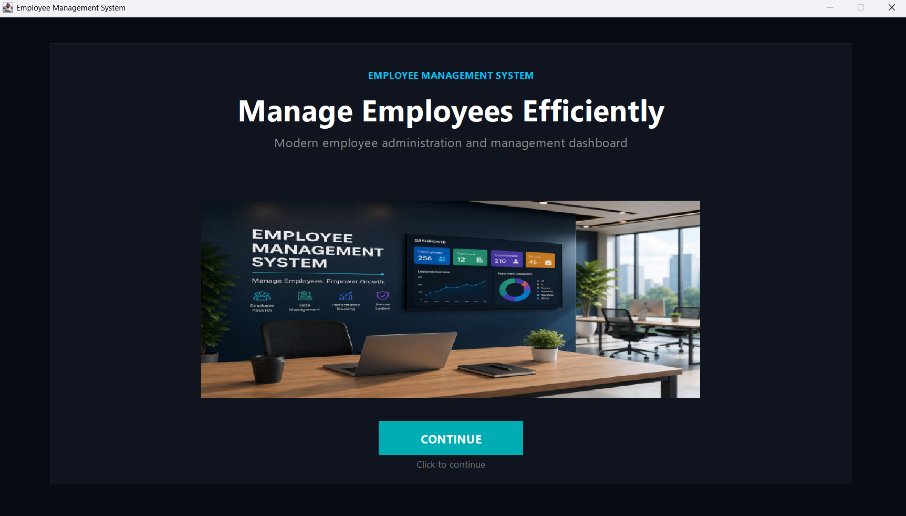
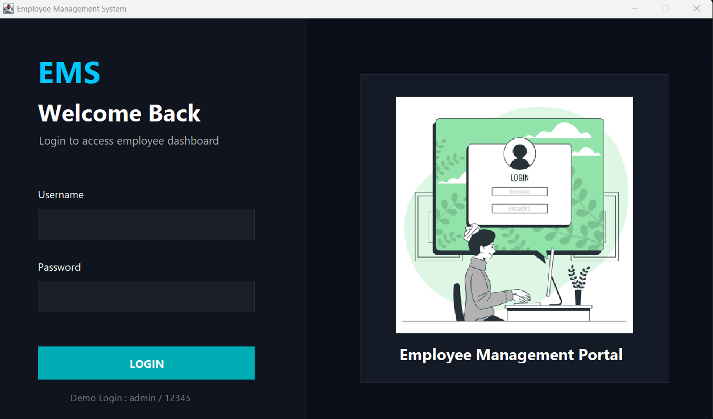
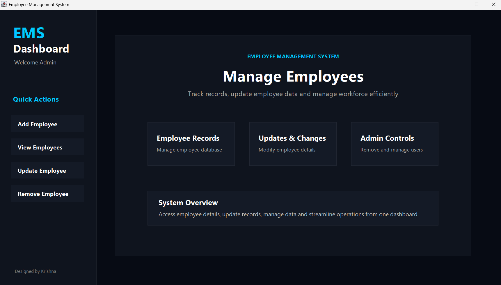
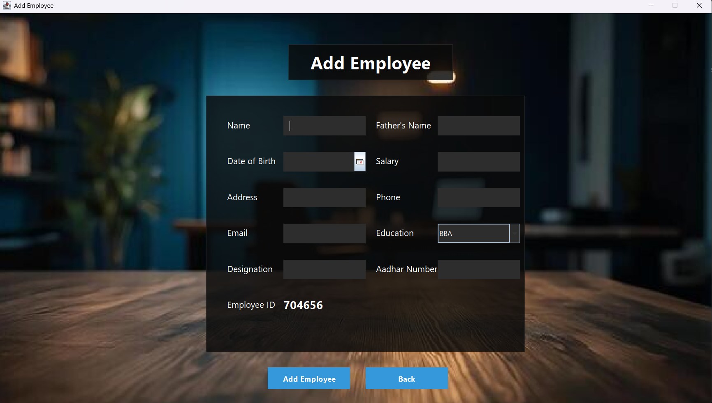
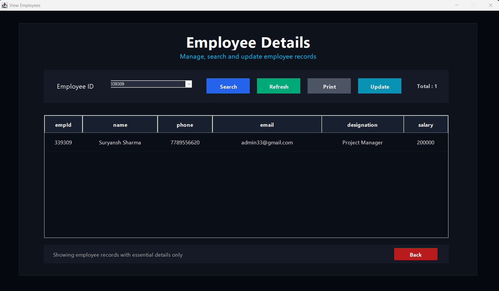
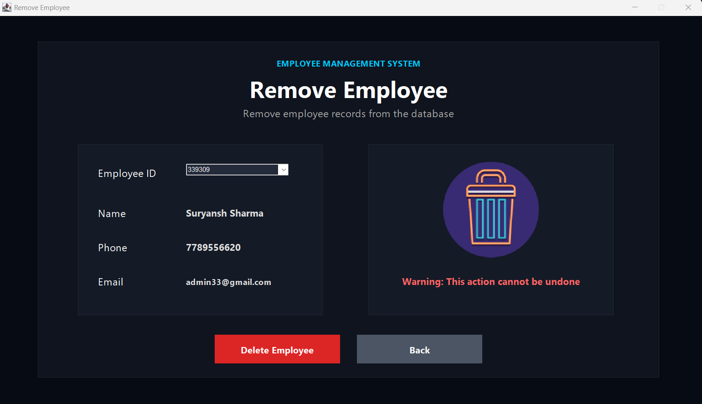

# Employee Management System

A modern Employee Management System built using Java Swing and MySQL with a clean and professional dark-themed dashboard UI.

---

# Features

- Admin Login Authentication
- Add Employee
- View Employees
- Update Employee
- Remove Employee
- Search Employee by ID
- Print Employee Records
- Modern Dashboard UI
- MySQL Database Integration
- Responsive Table Design
- Interactive Buttons and Hover Effects

---

# Tech Stack

- Java
- Java Swing
- AWT
- JDBC
- MySQL
- NetBeans IDE

---

# UI Design

- Modern dark theme
- Dashboard-based layout
- Flat modern buttons
- Styled data tables
- Premium admin panel appearance
- Clean Segoe UI typography
- Interactive hover effects

---

# Project Structure

```bash
src/
 ├── employee/
 │    └── management/
 │         └── system/
 │              ├── Splash.java
 │              ├── Login.java
 │              ├── Home.java
 │              ├── AddEmployee.java
 │              ├── ViewEmployee.java
 │              ├── UpdateEmployee.java
 │              ├── RemoveEmployee.java
 │              └── Conn.java
 │
 └── icons/
      ├── front.jpg
      ├── second.jpg
      ├── add_employee.jpg
      ├── delete.png
      ├── home.jpg
      └── bg.jpg
```

---

# Database Setup

## Create Database

```sql
create database employeemanagementsystem;
```

## Use Database

```sql
use employeemanagementsystem;
```

## Create Login Table

```sql
create table login(
    username varchar(20),
    password varchar(20)
);
```

## Insert Default Admin Login

```sql
insert into login values('admin', '12345');
```

## Create Employee Table

```sql
create table employee(
    name varchar(40),
    fname varchar(40),
    dob varchar(30),
    salary varchar(20),
    address varchar(100),
    phone varchar(20),
    email varchar(40),
    education varchar(40),
    designation varchar(40),
    aadhar varchar(20),
    empId varchar(20)
);
```

---

# Default Login Credentials

```txt
Username: admin
Password: 12345
```

---

# Screenshots

## Splash Screen



---

## Login Screen



---

## Dashboard



---

## Add Employee



---

## View Employees



---

## Remove Employee



---

# Future Improvements

- PreparedStatement for SQL Injection Prevention
- Role-based Authentication
- Employee Profile Images
- Dashboard Analytics
- Export Data to PDF/Excel
- Search Filters
- Pagination Support

---

# Author

Krishna Sharma

GitHub:
https://github.com/krishnash648